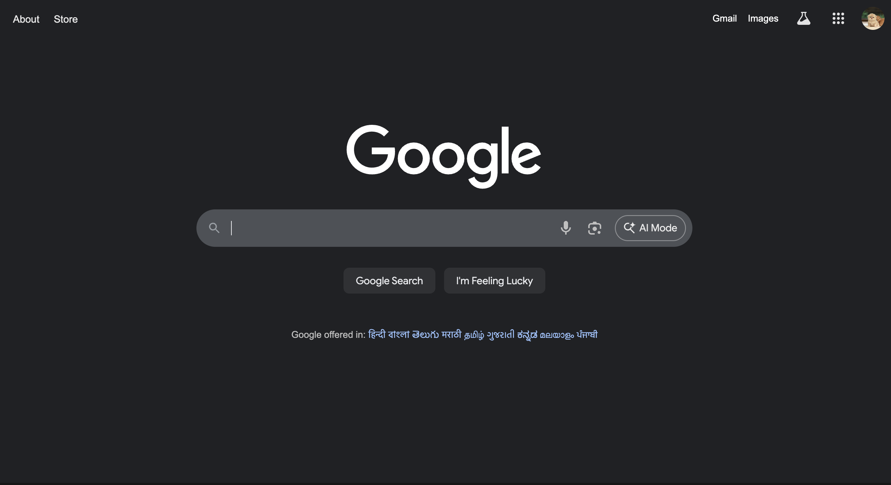
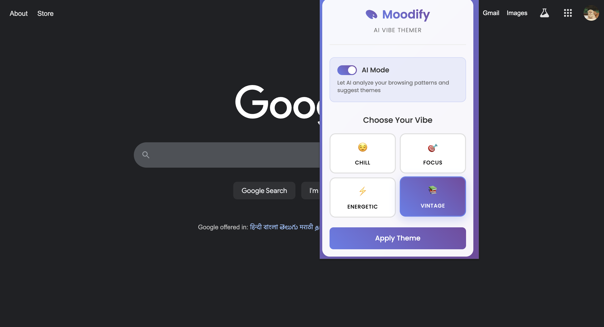
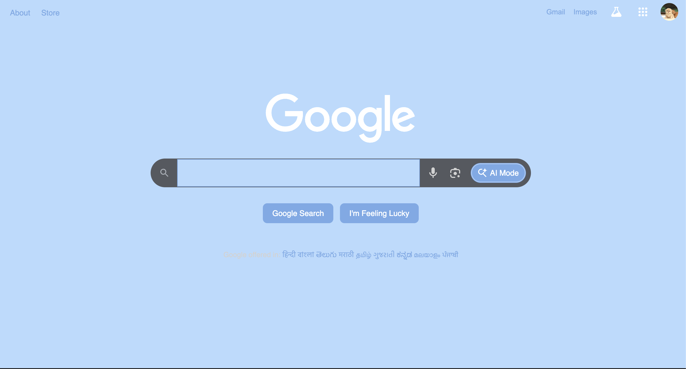
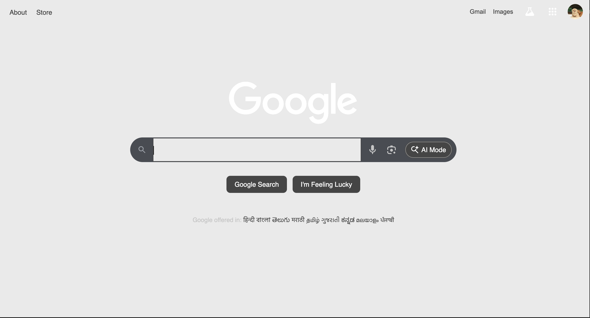
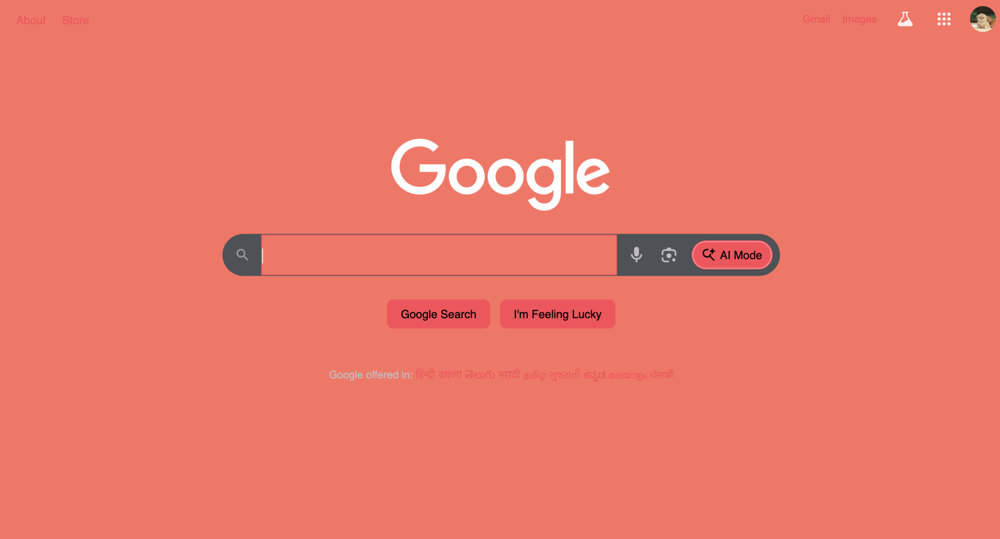
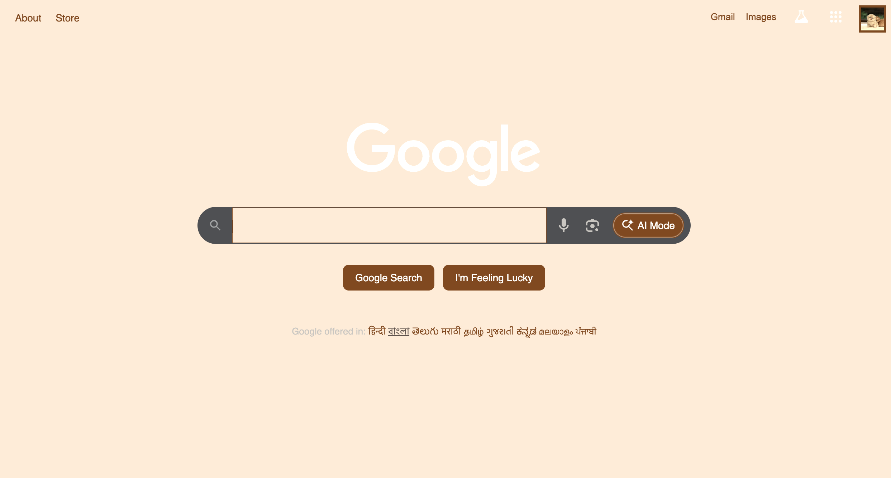

# 🌈 Moodify — AI-Powered Theme-Changing Chrome Extension

**Moodify** is a Chrome extension that changes the theme of any webpage based on your **mood and interaction**.  
It automatically detects user behavior, such as typing speed and interaction style, to suggest and apply themes like:

- Chill 🛋️  
- Focus 🎯  
- Energetic ⚡  
- Vintage 🕰️  

Built in free time to explore **AI implementation in browser extensions**.

---

## 🖥️ How It Works

1. **Detects user interaction patterns**  
   - Typing speed  
   - Click frequency  
   - Scroll behavior  

2. **AI predicts the user mood** based on these patterns  

3. **Applies a theme** automatically or allows manual selection:  
   - Chill / Focus / Energetic / Vintage  

4. All logic runs **client-side**, no external servers required.

---

## 📸 Screenshots

| Step | Screenshot | Description |
|------|-----------|-------------|
| 1 |  | Google homepage (default) |
| 2 |  | Extension popup — theme selection |
| 3 |  | Chill mode applied |
| 4 |  | Focus mode applied |
| 5 |  | Energetic mode applied |
| 6 |  | Vintage mode applied |

---

## 🚀 Features

- AI-based mood detection from user interactions  
- Multiple dynamic themes  
- Manual theme selection possible  
- Lightweight, runs entirely in **JS + HTML + JSON**  
- Works on any website you visit  
- Designed as a learning project to experiment with AI in Chrome extensions

---

## ▶️ How to Run Locally

1. Open Chrome and navigate to:
chrome://extensions/

2. Enable **Developer mode**  
3. Click **Load unpacked**  
4. Select the `Moodify` folder  
5. Pin the extension to toolbar and start testing

---

## 💡 Future Enhancements

- Improve AI accuracy with more interaction metrics  
- Add custom theme editor  
- Track user preferences over time  
- Add gamification (coins / points for usage)  

---

## 👨‍💻 Author

**Azmil Mohammed K S**  
Built in free time to explore **AI in browser extensions** and dynamic theme adaptation.

---

## 📜 License

MIT License

